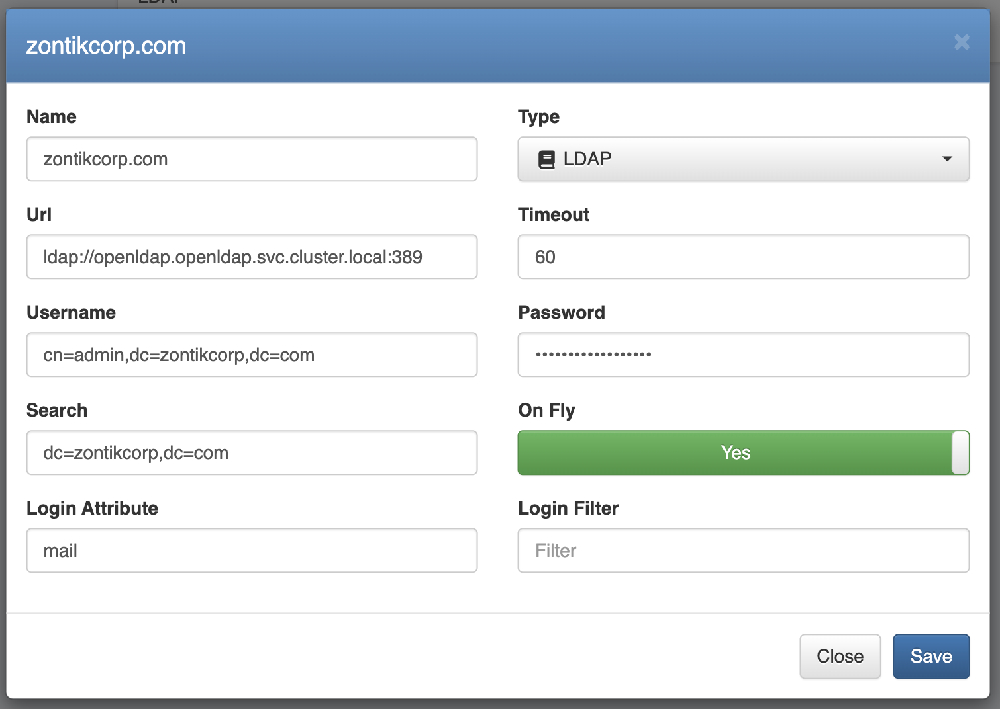

# OpenLDAP

One of the backend options supported in *mavapa* is to use *OpenLDAP*.

## Deployment

There are many ways to deploy *OpenLDAP* but for the purpose of this example, we are going to deploy it in **Kubernetes**. We can use helm charts to perform this integration following the next steps:

```shell
$ helm repo add jp-gouin https://jp-gouin.github.io/helm-openldap/
$ HELM_VALUES_OPENLDAP=$(mktemp)
$ cat <<EOF >$HELM_VALUES_OPENLDAP
replicaCount: 1
env:
  LDAP_ORGANISATION: "Zontik Corporation"
  LDAP_DOMAIN: "zontikcorp.com"

persistence:
  enabled: true
  size: 5Gi

phpldapadmin:
  enabled: false

ltb-passwd:
  enabled: false
EOF
$ helm upgrade --install openldap jp-gouin/openldap \
-n openldap --create-namespace \
-f $HELM_VALUES_OPENLDAP
$ kubectl get secret --namespace openldap openldap \
-o jsonpath="{.data.LDAP_ADMIN_PASSWORD}" | base64 --decode; echo
$ kubectl get secret --namespace openldap openldap \
-o jsonpath="{.data.LDAP_CONFIG_PASSWORD}" | base64 --decode; echo
```

To perform the initial population of the OpenLDAP tree we would need to reach our service from our local computer with **ldap-tools**, to do so we will need to use port forwarding.

```shell
$ kubectl port-forward service/openldap 3389:ldap-port -n openldap
```

> In case we don't have ldap-tools installed in our local computer we can deploy a container with these tools ready to use for this operation.

## Population

Once have our OpenLDAP service up, running, and reachable from our mavapa installation we can create the following tree structure using ldif:

```shell
$ OPENLDAP_LDIF_INITIAL=$(mktemp)
$ cat <<EOF >$OPENLDAP_LDIF_INITIAL
dn: ou=People,dc=zontikcorp,dc=com
objectClass: organizationalUnit
ou: People

dn: ou=Groups,dc=zontikcorp,dc=com
objectClass: organizationalUnit
ou: Groups

dn: ou=Apps,dc=zontikcorp,dc=com
objectClass: organizationalUnit
ou: Apps

dn: cn=ldapusers,ou=Groups,dc=zontikcorp,dc=com
objectClass: top
objectClass: posixGroup
gidNumber: 10000

dn: uid=sergio.tocalini,ou=People,dc=zontikcorp,dc=com
changetype: add
objectClass: inetOrgPerson
objectClass: posixAccount
cn: Sergio
sn: Tocalini
givenName: Sergio
displayName: Sergio Tocalini
uid: sergio.tocalini
mail: sergio.tocalini@zontikcorp.com
uidNumber: 1000
gidNumber: 1000
gecos: Sergio Tocalini
loginShell: /bin/bash
homeDirectory: /home/sergio.tocalini

EOF
$ ldapadd -x -H ldap://localhost:3389 \
-D "cn=admin,dc=zontikcorp,dc=com" \
-f $OPENLDAP_LDIF_INITIAL \
-W
Enter LDAP Password:
adding new entry "ou=People,dc=zontikcorp,dc=com"

adding new entry "ou=Groups,dc=zontikcorp,dc=com"

adding new entry "ou=Apps,dc=zontikcorp,dc=com"

adding new entry "cn=ldapusers,ou=Groups,dc=zontikcorp,dc=com"

adding new entry "uid=sergio.tocalini,ou=People,dc=zontikcorp,dc=com"

$ 
```

> LDAP Password is referring to the **LDAP_ADMIN_PASSWORD** in the Kubernetes secret.

As you may notice this user doesn't have a password assigned and we can do that using the following commands:

```shell
$ slappasswd -h {SHA}
New password:
Re-enter new password:
{SHA}jo7hn9as5bkj+kmnhjbfsdbhjbf=
$ OPENLDAP_LDIF_MODIFY=$(mktemp)
$ cat <<EOF >$OPENLDAP_LDIF_MODIFY
dn: uid=sergio.tocalini,ou=People,dc=zontikcorp,dc=com
changetype: modify
add: userPassword
userPassword: {SHA}kl8Km4j5bhue+Mp0pZ3QvFnzvns=
EOF
$ ldapmodify -x -H ldap://localhost:3389 \
-D "cn=admin,dc=zontikcorp,dc=com" \
-f $OPENLDAP_LDIF_MODIFY \
-W
Enter LDAP Password:
modifying entry "uid=sergio.tocalini,ou=People,dc=zontikcorp,dc=com"

$
```

> LDAP Password is referring to the **LDAP_ADMIN_PASSWORD** in the Kubernetes secret.

To reset the password once it is not empty we can perform the following operation:

```shell
$ ldappasswd -H ldap://localhost:3389 -x \
-D "cn=admin,dc=zontikcorp,dc=com" -W -A -S \
"uid=sergio.tocalini,ou=People,dc=zontikcorp,dc=com"
Old password:
Re-enter old password:
New password:
Re-enter new password:
Enter LDAP Password:

$
```

> LDAP Password is referring to the **LDAP_ADMIN_PASSWORD** in the Kubernetes secret.

## Onboarding

Integration between **mavapa** and **OpenLDAP** requires a direct connection from the installation to the service. Once we have this connectivity established we are able to onboard the Organization using the next form:


